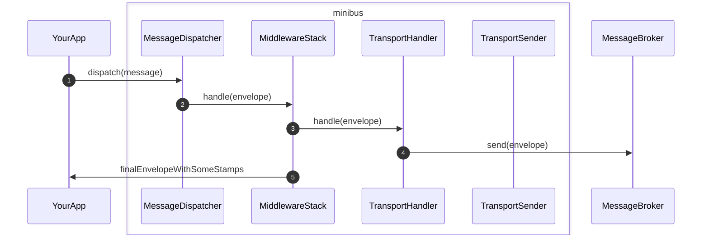

# PHP MiniBus: Transport

`php-minibus-transport` provides classes and interfaces to send messages to
other apps via message brokers like RabbitMQ, Kafka, AWS SQS/SNS etc.

## The big picture

p.s. in addition to [Sender](src/Sender.php) `php-minibus-transport` also
provides [Receiver](src/Receiver.php) so that an app can fetch messages from
a message broker.
