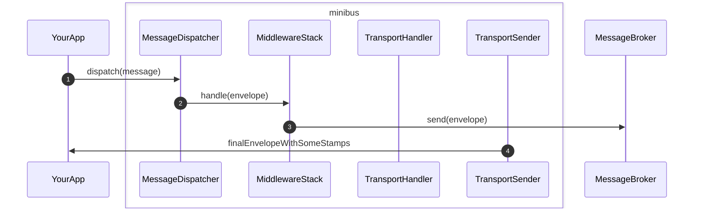
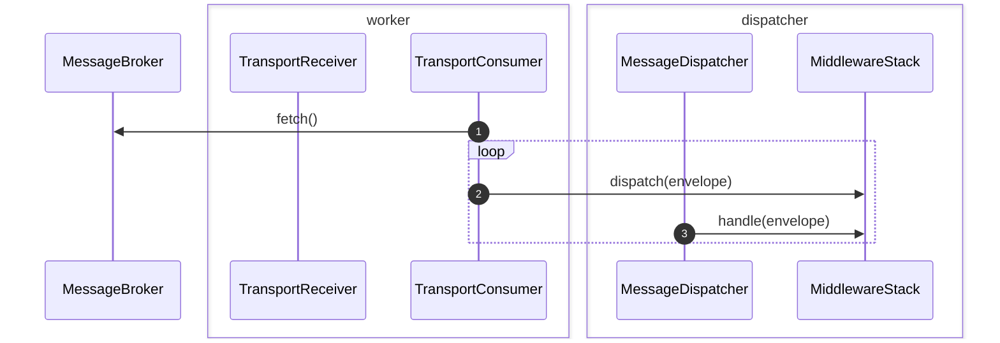

# PHP MiniBus: Transport

`php-minibus-transport` provides classes and interfaces to send or receive
messages to other apps or systems, so they can be handled externally or
asynchronously, via message broker or such.

## The big picture

### Send messages

### Worker: Fetch and dispatch envelopes

